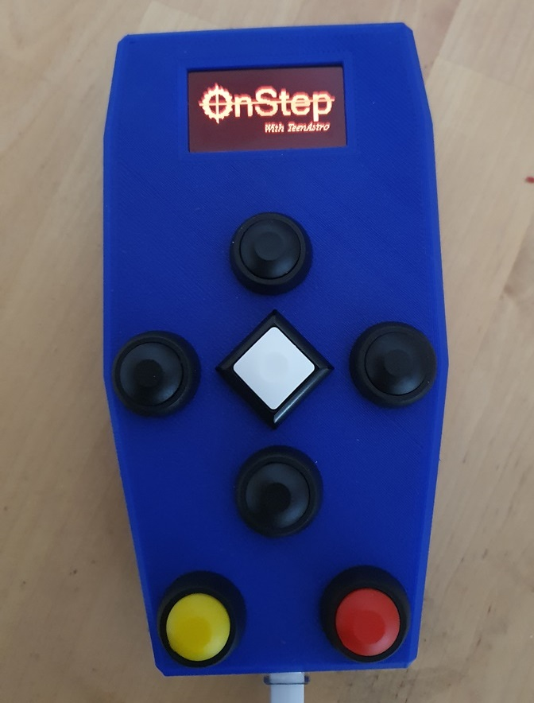
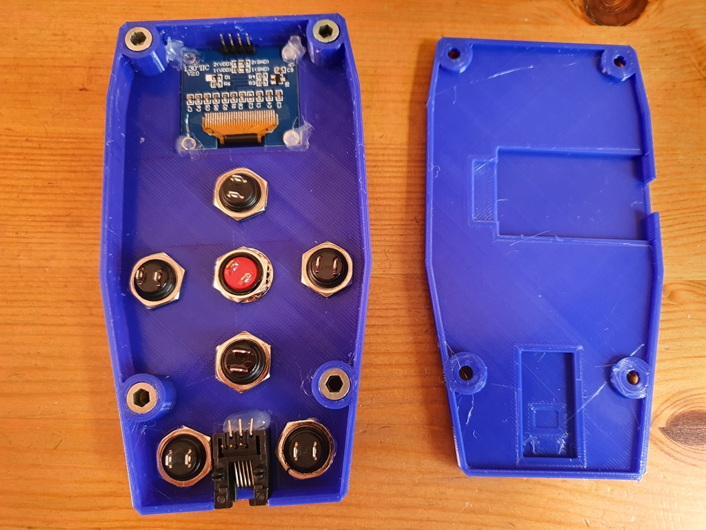
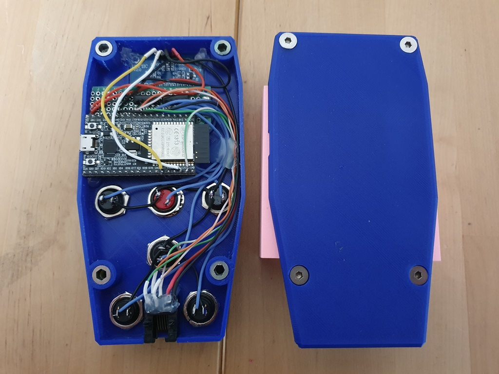

# OnStep Smart Hand Controller

[ESP32 (DevKit C) version of the Smart Hand Controller](https://baheyeldin.com/astronomy/onstep-esp32-smart-hand-controller-shc.html)

Here are the OpenScad and STL files of my version of the case. 
As I do not use the central joystick, I managed to solder everything in place without the need for a PCB.
Instead, I used a small piece of protoboard directly soldered to the ESP pins 
to solder the 2.2k resistor network needed for the buttons and a bit of hot glue to keep
everything together.

The push buttons are PBS-330B model, except for the white one I had lying around but it has the same cutprint.

The box was printed in PLA, with 0.4mm nozzle :
- 0.4mm line width
- 0.2mm layer height
- 25% gyroid infill
- no support

